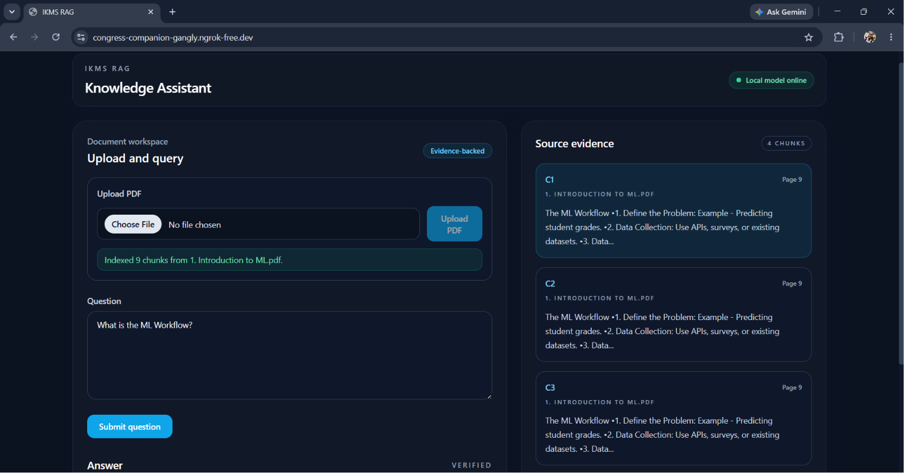
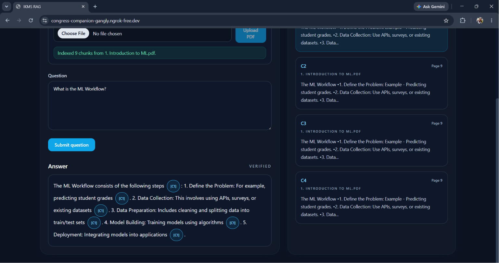

# IKMS RAG Citations

A local, evidence-aware Retrieval-Augmented Generation (RAG) application for querying PDF documents with citations.

 Live Demo : https://congress-companion-gangly.ngrok-free.dev/

This project uses:
- FastAPI backend
- Vite + React + TypeScript frontend
- Ollama for local LLM inference
- local FAISS vector store for embeddings
- PDF ingestion and citation-aware answer generation

 
 
## Features

- Upload PDF documents
- Split and index text into chunks
- Retrieve relevant content with vector similarity
- Generate answers grounded in retrieved evidence
- Display citations and source snippets
- Run fully local without cloud API keys

## Tech Stack

- Backend: Python, FastAPI, LangChain, LangGraph
- Frontend: React, TypeScript, Vite, Tailwind CSS
- AI: Ollama (`gemma3:12b`, `all-minilm`)
- Vector store: FAISS

## Project Structure

```text
IKMS_RAG/
├── backend/
│   ├── src/
│   │   └── app/
│   ├── requirements.txt
│   └── pytest.ini
├── frontend/
│   ├── src/
│   ├── package.json
│   └── vite.config.ts
├── .env.example
├── .gitignore
├── requirements.txt
├── README.md
└── .faiss_store/
```

## Prerequisites

Before running the app, install:

- Python 3.11+
- Node.js 18+
- Ollama
- Local Ollama models:
  - `gemma3:12b`
  - `all-minilm`

Install models with:

```bash
ollama pull gemma3:12b
ollama pull all-minilm
```

## Setup

1. Clone the repository:

```bash
git clone https://github.com/sanjulaS23/ikms-rag-citations.git
cd ikms-rag-citations
```

2. Create a virtual environment:

```bash
python -m venv .venv
```

3. Activate it:

Windows:

```bash
.venv\Scripts\activate
```

4. Install Python dependencies:

```bash
pip install -r requirements.txt
```

5. Install frontend dependencies:

```bash
cd frontend
npm install
cd ..
```

6. Configure local environment:

```bash
copy .env.example .env
```

Then verify the following values:

```env
OLLAMA_BASE_URL=http://localhost:11434
OLLAMA_MODEL=gemma3:12b
OLLAMA_EMBEDDING_MODEL=all-minilm
```

## Run the Application

### Backend

```bash
cd backend
set PYTHONPATH=src
python -m uvicorn app.main:app --host 0.0.0.0 --port 8000 --reload
```

### Frontend

```bash
cd frontend
npm run dev -- --host 0.0.0.0 --port 5173
```

Then open:

- Frontend: http://localhost:5173
- Backend API Docs: http://localhost:8000/docs

## Usage

1. Upload a PDF file using the UI.
2. Ask a question about the document.
3. Review the answer and the cited source snippets.

## Notes

- This project is designed for offline/local use with Ollama.
- The FAISS index is stored locally under `.faiss_store/`.
- The app is optimized for evidence-grounded answers with citations.

## License

This project is licensed under the MIT License.
